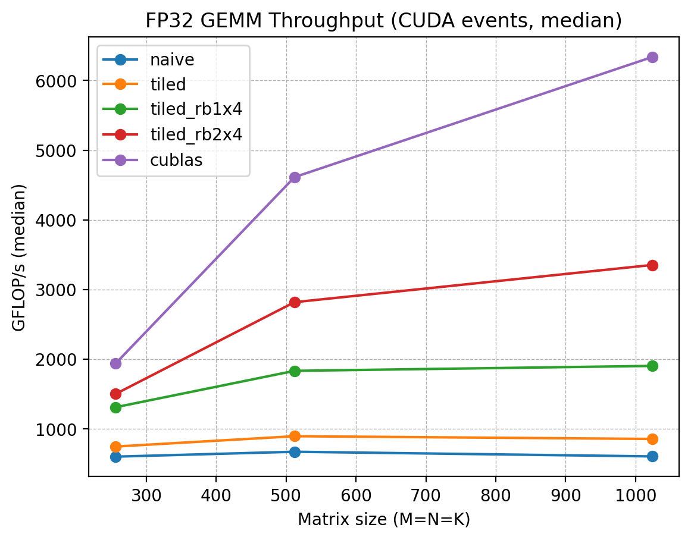
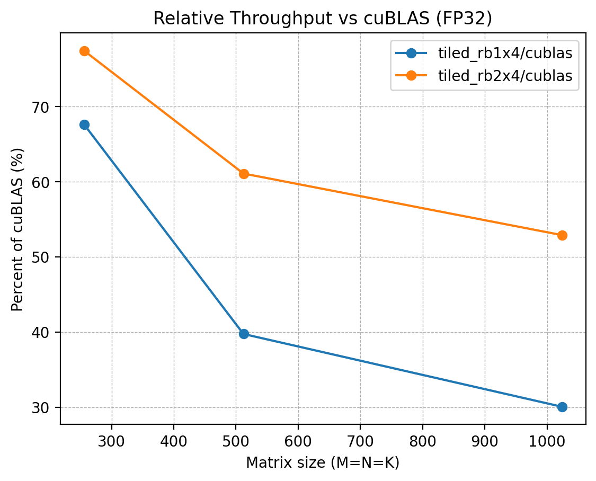

# CUDA GEMM Optimization Practice（FP32 主线）

## 项目目标

本项目用于练习 CUDA / GPU 性能优化与 profiling，围绕 GEMM（矩阵乘法）实现一条清晰的优化链路，并用 **benchmark 数据 + Nsight Compute 指标**形成可复现实验结论。

当前主线聚焦 **FP32 GEMM**（后续再扩展到 FP16 / Tensor Core）：

- naive GEMM baseline
    
- shared memory tiling 优化
    
- thread coarsening / register blocking（每线程计算 1x4 / 2x4 输出）
    
- 统一口径 benchmark（稳态性能对比）
    
- 初步 NCU 指标分析（瓶颈解释）
    

## 当前进展

-  搭建 benchmark 框架：参数化 M/N/K，CUDA events 计时，输出 min/median/avg 与 GFLOP/s
    
-  naive GEMM kernel（CPU reference correctness check）
    
-  tiled GEMM kernel（shared memory tiling）
    
-  tiled_rb1x4 GEMM kernel（thread coarsening）

-  接入 cublasSgemm 做参照（已完成）

-  tiled_rb2x4 GEMM kernel（thread coarsening）
    
-  统一口径 batch benchmark & 性能对比表（见下文）
    
-  Nsight Compute 对比（tiled vs tiled_rb1x4 vs tiled_rb2x4，见下文）
    
-  完整图表与报告式总结（见下文）
    

## 环境

- GPU: NVIDIA GeForce RTX 4060 Laptop GPU
    
- OS: WSL2 Ubuntu
    
- CUDA: 13.1
    
- Compiler: g++ / nvcc 12.8
    
- Tools: Nsight Compute / Nsight Systems（基础使用）
    


## 目录结构

```text
gemm-fp16/
  src/
    main_bench.cu            # benchmark 入口（--impl/--M/--N/--K/--warmup/--repeat/--no-check）
    gemm_naive.cu            # naive GEMM
    gemm_tiled.cu            # tiled GEMM（shared memory）
    gemm_tiled_rb1x4.cu      # tiled + register blocking（每线程 1x4 输出）
    gemm_tiled_rb2x4.cu      # tiled + register blocking（每线程 2x4 输出）
    gemm_cublas.cu           # cublasSgemm baseline
    utils.cuh                # 工具函数 / 校验 / 计时辅助
  scripts/
    run_bench.sh             # 批量跑 benchmark
    collect_env.sh           # 导出环境信息
    plot.py                  # 画图脚本
  results/
    raw/                     # 原始结果（日志/CSV）
    plots/                   # 图表
  profiles/
    nsys/                    # Nsight Systems traces
    ncu/                     # Nsight Compute reports
  logs/
```


## 复现方式（Build / Run）

### 1) 构建（WSL2 Ubuntu）

```bash
cd ~/gemm-fp16/build  
cmake ..  
make -j
```

构建产物：`build/bench_gemm`

### 2) 单点运行

下面命令会执行 CPU reference 校验并给出 GFLOP/s（使用 CUDA events 计时）：

```bash
./bench_gemm --impl tiled_rb1x4 --M 256 --N 256 --K 256 --warmup 3 --repeat 10  
./bench_gemm --impl tiled_rb1x4 --M 512 --N 512 --K 512 --warmup 3 --repeat 10
```

### 3) 批量 benchmark

运行脚本（默认 `warmup=3, repeat=10`，对 `256/512/1024`，实现 `naive/tiled/tiled_rb1x4` 共 9 个点）：

```bash
bash scripts/run_bench.sh
```

脚本输出文件路径与命名规则：

- 输出目录：`results/raw/`
    
- 文件名：`bench_fp32_YYYYmmdd_HHMMSS.txt`  
    例如：`results/raw/bench_fp32_20260225_214132.txt`
    

也可以自定义参数：

```bash
BUILD_DIR=build WARMUP=5 REPEAT=20 bash scripts/run_bench.sh
```


## 实验口径说明

### 1) 性能对比

- 计时方式：CUDA events
    
- `warmup >= 3`，`repeat >= 10`
    
- 使用 **median** 作为稳定性能指标
    
- correctness check：对 CPU reference 做校验（可通过 `--no-check` 关闭，用于纯 profiling 或批量跑更快）
    

### 2) NCU profiling

- NCU 会显著扰动运行时间，因此 **NCU 输出的 ms/GFLOP/s 不用于性能结论**
    
- 建议口径：`--no-check --warmup 0 --repeat 1`（或只看 repeat 对应的那次 kernel launch）
    

## 当前结果（阶段性，FP32）

### Benchmark results（CUDA events，warmup=3，repeat=10，取 median；全部 correctness PASS）

| Impl            |          256³ |          512³ |         1024³ |
| --------------- | ------------: | ------------: | ------------: |
| naive           |      601.765  |      672.164  |      605.326  |
| tiled           |      746.583  |      895.119  |      856.008  |
| tiled_rb1x4     |     1310.720  |     1833.175  |     1904.122  |
| **tiled_rb2x4** | **1501.183**  | **2818.753**  | **3352.761**  |
| cublas (sgemm)  |     1938.218  |     4612.927  |     6337.302  |


> cuBLAS baseline：使用 `cublasSgemm`，并通过 row-major→column-major 的等价映射实现 `C = A × B`（row-major 语义），math mode = `CUBLAS_DEFAULT_MATH`。

### Relative to cuBLAS (rb1x4 / rb2x4 与 cublas 的GFLOPS比值)

| Size  | rb1x4 / cublas | **rb2x4 / cublas** |
| ----- | -------------: | -----------------: |
| 256³  |         67.63% |         **77.46%** |
| 512³  |         39.74% |         **61.11%** |
| 1024³ |         30.05% |         **52.90%** |
### Speedup summary

| Size  | tiled / naive | rb1x4 / tiled | **rb2x4 / rb1x4** |
| ----- | ------------: | ------------: | ----------------: |
| 256³  |         1.24× |         1.76× |         **1.15×** |
| 512³  |         1.33× |         2.05× |         **1.54×** |
| 1024³ |         1.41× |         2.22× |         **1.76×** |


### 可视化（results/plots）





> 图表由 `scripts/plot.py` 从 `results/raw/bench_fp32_20260226_152021.txt` 解析生成。
    
### Nsight Compute 初步瓶颈解释（tiled vs tiled_rb1x4，1024³，profiling-only）

> 说明：下表指标用于解释瓶颈方向，不作为最终性能结论。

| 指标 | tiled | rb1x4 | rb2x4 | 结论/变化解释 |
| :--- | :--- | :--- | :--- | :--- |
| Achieved Occupancy (%) | 98.55 | 79.92 | 63.15 | **tiled -> rb1x4 -> rb2x4**：每线程计算更多输出/寄存器压力更大，occupancy 下降 |
| **Warp Cycles per Issued Instruction (cycle)** | **38.13** | **26.49** | **15.12** |**rb1x4 -> rb2x4**：**下降约 43%**：warp 发指令更紧凑，空转更少 |
| **Stall MIO Throttle (cycles/inst)** | **20.02** | **12.98** | **4.66** |**rb1x4 -> rb2x4**：**显著下降约 64%**：MIO 队列压力减轻，shared/load 等指令相关瓶颈被摊薄 |
| **Stall Barrier (cycles/inst)** | **5.97** | **3.98** | **1.81** |**rb1x4 -> rb2x4**：**下降约 54%**：同步/屏障开销被摊薄（每次加载/同步覆盖更多计算） |
| Compute (SM) Throughput (SOL, %) | 96.67 | 53.63 | 65.88 |**rb1x4 -> rb2x4**：计算侧利用率提高（与更高 GFLOP/s 一致） |
| Memory Throughput (SOL, %) | 96.67 | 74.91 | 86.86 |**rb1x4 -> rb2x4**：rb2x4 更能持续推进内存侧吞吐（更少被 stall 卡住） |

### Nsight Compute：rb1x4 → rb2x4 的瓶颈解释（1024³，profiling-only）
将每线程输出从 1×4 扩展到 2×4（rb2x4）后，Achieved Occupancy 从 **79.92%** 降至 **63.15%**，这是 coarsening/register blocking 增加寄存器与线程资源占用导致的预期 trade-off。但更关键的是，warp-level stall 显著下降：

- Stall MIO Throttle：**12.98 → 4.66 cycles/inst**（约 **-64%**）
    
- Stall Barrier：**3.98 → 1.81 cycles/inst**（约 **-54%**）
    
- Warp Cycles per Issued Instruction：**26.49 → 15.12 cycle**（约 **-43%**）
    
- Memory Throughput（SOL）：**74.91% → 86.86%**；Compute Throughput（SOL）：**53.63% → 65.88%**
    

这说明 rb1x4 仍较多受 MIO 指令队列压力（包含 shared memory 相关指令）与 barrier/sync 开销影响；rb2x4 通过提高每次 tile load / sync 所覆盖的有效计算量，进一步摊薄 shared-load 与同步的固定成本，使 warp 更少处于“发不出下一条指令”的空转状态。对应到稳态 benchmark，rb2x4 在 1024³ 上将吞吐提升到 **3352.761 GFLOP/s**（相对 rb1x4 的 1904.122 GFLOP/s 约 **1.76×**），并达到 cuBLAS 的约 **52.90%**。

### 结论（阶段性）

- **naive → tiled**：通过 shared memory tiling 提升数据复用，在 256³/512³/1024³ 上分别达到 **1.24×/1.33×/1.41×**。
    
- **tiled → rb1x4**：沿 N 方向 register blocking（每线程 1×4 输出）显著摊薄 per-output 的 shared load / sync / address calc 等开销，1024³ 上提升到 **1904 GFLOP/s（2.22× over tiled）**。
    
- **rb1x4 → rb2x4**：进一步沿 M 方向 coarsening（每线程 2×4 输出），在 1024³ 上达到 **3353 GFLOP/s（1.76× over rb1x4）**，并将相对 cuBLAS 的比例从 **30.05%** 提升到 **52.90%**。
    
- 下一步若继续逼近 cuBLAS：优先考虑向量化 global load（例如 `float4`）、shared memory layout/padding 降低 bank conflict、以及更深的寄存器分块（结合 occupancy 与 stall 再做权衡）。


## 下一步计划（短期）
    
1. 更系统化的 NCU 分析：补充指令/内存事务（global/shared）与 roofline 视角的解释
    
2. 视时间进行 block shape sweep（如 16×16、32×8、64×8 等）验证性能敏感性
    
3. 主线收束后再扩展 FP16 / Tensor Core 版本（作为进阶）
